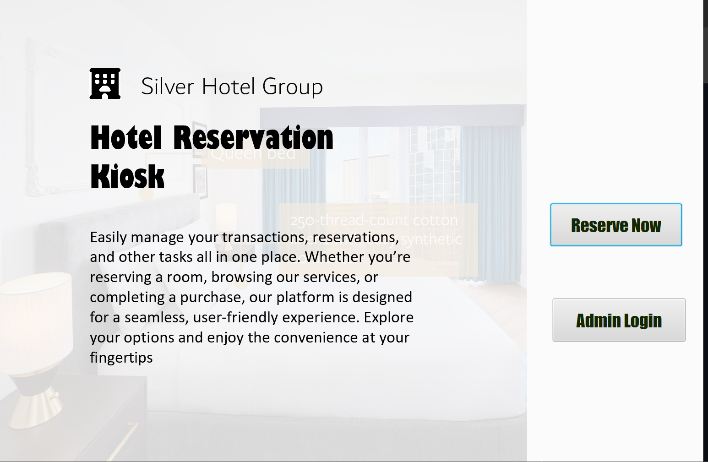

# Hotel Reservation Desktop Application

## Self-Checkout for Users:

Users can check out of the hotel, possibly after viewing their bill and confirming their charges.
## Admin Dashboard:

### Booking Management
 Admin can view all bookings, check booking status, and delete bookings if needed.
 
### Discount Management
 Admin can apply discounts to bookings (e.g., up to 25% discount).
 
### Room Availability
Admin can check the availability of rooms and manage them as well as all the bookings.


## Installation

Install my-project with npm

```bash
clone the repo
Download Eclipse/Intellij
Download JavaFX 
Run the Application
```

## Demo

[Demo of the Application](https://youtu.be/jeekMGtN_t8?si=em3-avG5WbUjzHMr)


## Authors

- [@sukhad123](https://www.github.com/sukhad123)
